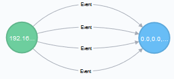
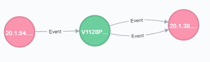
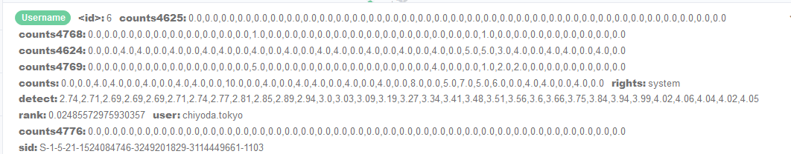

# Logon Tracer

It is a <a href="https://github.com/JPCERTCC/LogonTracer/"> project published on GitHub by the Japan CERT </a> which aims to analyze and detect malicious logins.
To fulfill this purpose, an EVTX file is loaded into Neo4j, so that the data is modeled as a graph database, connecting users and machines through events.

Changes have been made to this project both in the Back-end and in the Front-end. The changes made in the first one will be explained first, since they were the ones that motivated the changes of the second one.

## Back-end

Regarding the Back-end, this tool has been adapted in the following way:
- The Neo4j model is adapted to receive events from various hosts.
- The events are received from Kafka and are loaded in streaming.
- Time series are loaded to InfluxDB instead of to Neo4j, which are also received from Kafka.

#### Neo4j Model

The original project, loads an EVTX file (XML for Windows events) and transforms it into a graph in Neo4j. Each time a file is loaded, the entire database is overwritten, so the model is only prepared to audit the logs to a computer.
  In the following image, we observe what the original model proposed is:

    

In this model there are three types of nodes:
- **Date**: date on which the first event was held
- **IPAddress**: IP of the computer that is connected to the active directory equipment audited
- **Username**: user account who generated the event in question

This model assumes that only connections made to the active directory computer whose EVTX has been loaded will be stored. Although it is a very good approximation, the data that was wanted to be collected were from various computers in the active directory, so it was necessary to make changes in the model.

Not only is it necessary to know which users and from which IPs connections are made to the AD, but also to which AD equipment they have connected.

    

The node types become the following:
- **Date**: date on which the first event was held
- **IPAddress**: IP of the computer that is connected to the active directory equipment audited
- **DC**: IP of the domain controller to which the connection was made. This node is also IPAddress type to facilitate queries to Neo4j.
- **Username**: users who generated the event 

### From Batch to Streaming

Another requirement was to be able to load the Logon Tracer dynamically, since these events are received in real time in the form of a JSON that arrives through Kafka. This supposes a radical change of the back-end, since the input goes from being an EVTX in batch to being a JSON in streaming.

The streaming in Neo4j is done with the code of load_neo4j.py *. In order not to saturate this load, we only load the data, without applying the PageRank or ChangeFinder algorithms.

### Timeseries in InfluxDB
The time series that the original Logon Tracer loads are concatenations of Strings in attributes of the Neo4j nodes, as shown below.

     

To be able to explore, filter and group efficiently, the data has been loaded into InfluxDB instead of Neo4j. The code that performs the load to InfluxDB is *load_influxdb.py*. Said load is also done in real time.

### PageRank

The PageRank algorithm is calculated in Batch using NetworkX, updated every 5 minutes, with the code *pagerank.py*.

## Front-end

To adapt this tool to our purpose, we need to do some minimal changes in the front side:

- Flask server:
	- It has added a new path (/getTimeline). In this, we connect to the influxdb and run a query sended via post. As a result, this path return a JSON object, which is processed and displayed on the website.

- Main view:
	- The function 'BuildGraph' has been updated. Now, this function can run a query against Neo4j asking for the Domain Controllers (DC)
    - The function has been updated to show the graph using cytoscape.
    - The graph has been adapted to show the Domain Controllers returned by Neo4j.
    

     

- TimeLine View:
	- New function 'runInfluxDBQuery' has been added in JS. When its access to the URI '/getTimeLine' it's invoked. And it's can be run manually. For default its runned with 1 hour.

     

